# Challenge ONE | Java | Back-end | Hotel Alura

     

---

## 🖥️ Tecnologías Utilizadas:

- Java
- Eclipse
- Biblioteca JCalendar
- MySql
- Plugin WindowBuilder  

---
## ⚠️ Importante! ⚠️

☕ Use Java versión 8 o superior para compatibilidad.   
📝 Recomendamos usar el editor de Eclipse para compatibilidad con la Interfaz Gráfica.   
🎨 La interfaz contiene dos métodos importantes:
- setResizable(false): determina el tamaño de la ventana, y a través del parámetro <strong>false</strong>, la pantalla no se puede maximizar;
- setLocationRelativeTo(null): determina la ubicación de la ventana, y a través del parámetro <strong>null</strong> la mantiene centrada en la pantalla.

---

## 🚧 Proyecto

El programa que fue realizado con el lenguaje Java y está conectado con una base datos para gestionar información de reservas y llevar el control de los huéspedes todo almacenado en dicha bd debe tener las siguientes funciones y características:

- Control de acceso por medio de un usuario y contraseña.
- Almacenar los registros de reservas y huéspedes.
- Editar cada uno de los campos de los registros almacenados pero con la restricción de no podemos modificar el registro único (ID) del registro.
- Eliminar registros de huéspedes o reservas.
- Buscar registros en la base de datos desde la aplicación por medio del ID.

## 🖥️ Interfaz gráfica.

* Pantalla Inicial.

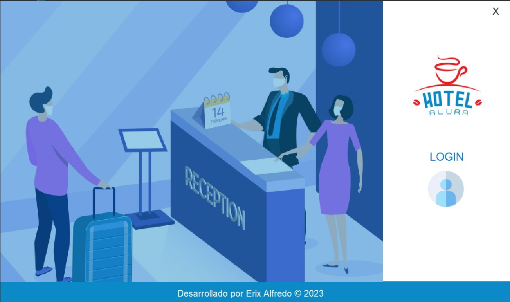

* Pantalla de inicio de sesion.

**-Menú Principal:**
El menú principal nos muestra la fecha en tiempo real y al costado un menú con dos opciones: 

- Registro de reservas.
- Búsqueda.

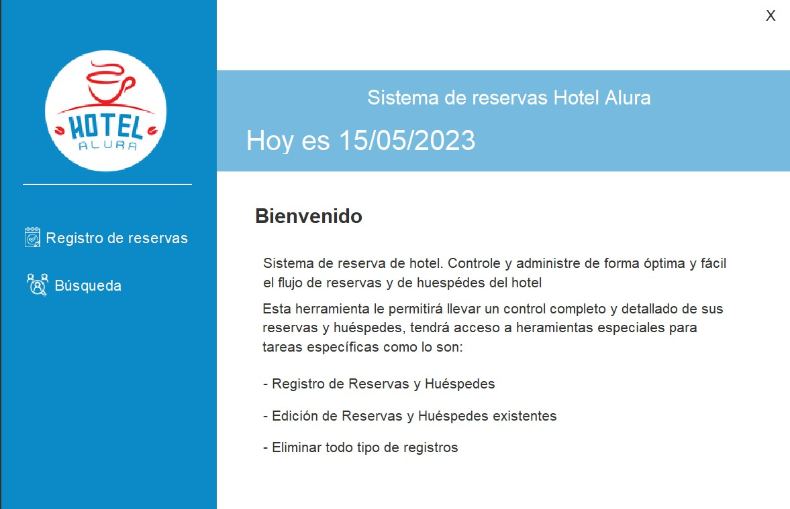

**-Sistema de Reservas:**

El sistema no permite que se ingrese una fecha de check out posterior a la fecha de check in ya que crearía una inconsistencia en el registro.

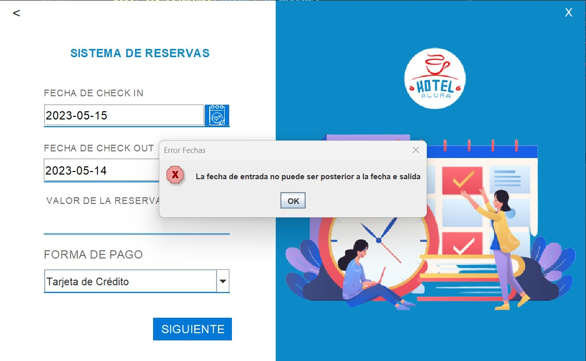

El sistema calcula automáticamente la cantidad total a pagar dependiendo el número de noches, contando también con 3 métodos de pagos, tarjeta de crédito, tarjeta de débito y efectivo.

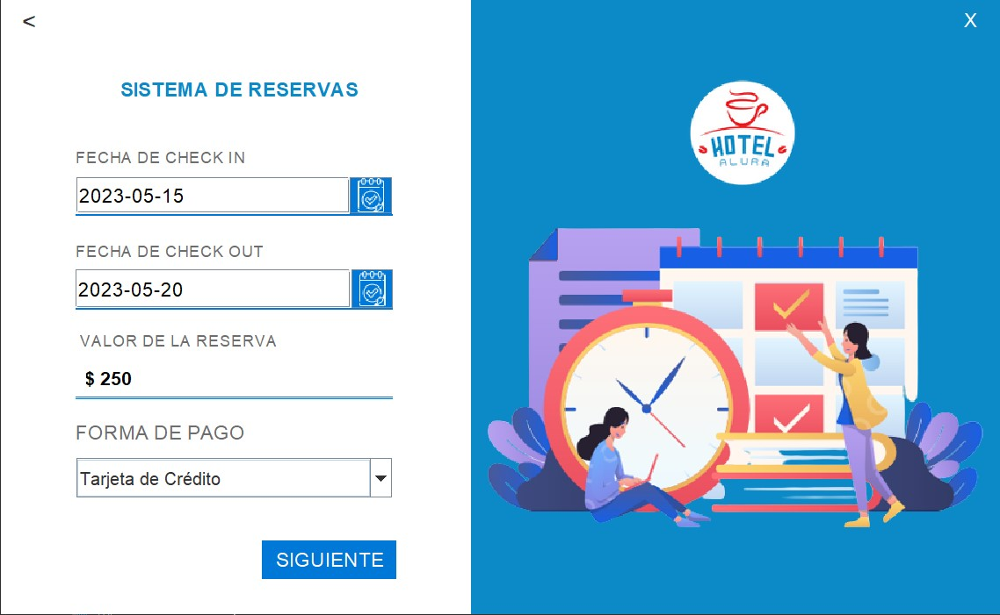

**-Registro de Huésped:**

En la ventana de registro de huésped se proporcionan los datos usualmente requeridos para almacenar en la bd y tener un registro, al guardar los datos saldrá una segunda ventana que confirma que se guardaron correctamente los datos del huésped.

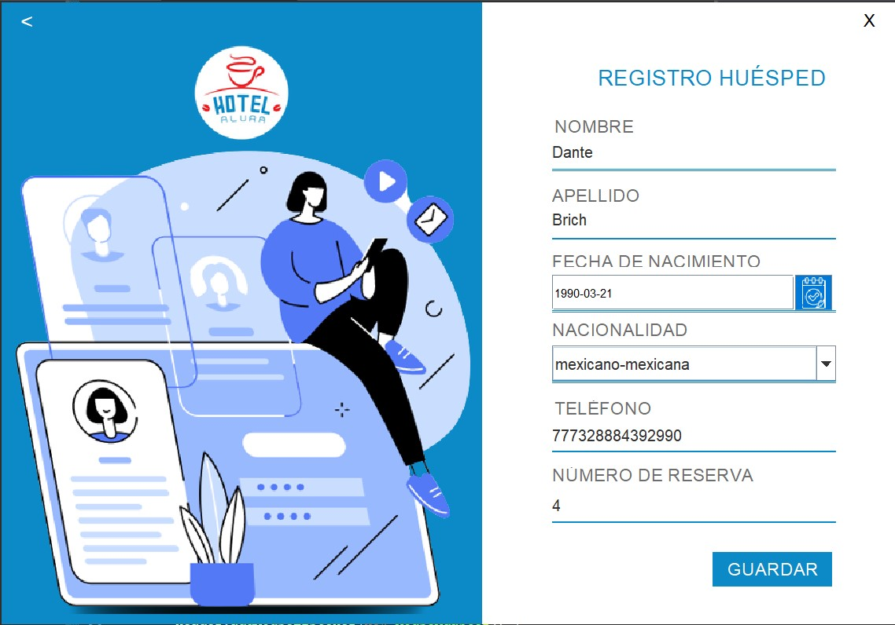 

**-Búsqueda de registros:**

En esta venta se muestra una lista de todos los registros que tenemos actualmente en nuestra bd tanto de huéspedes como de reservas.

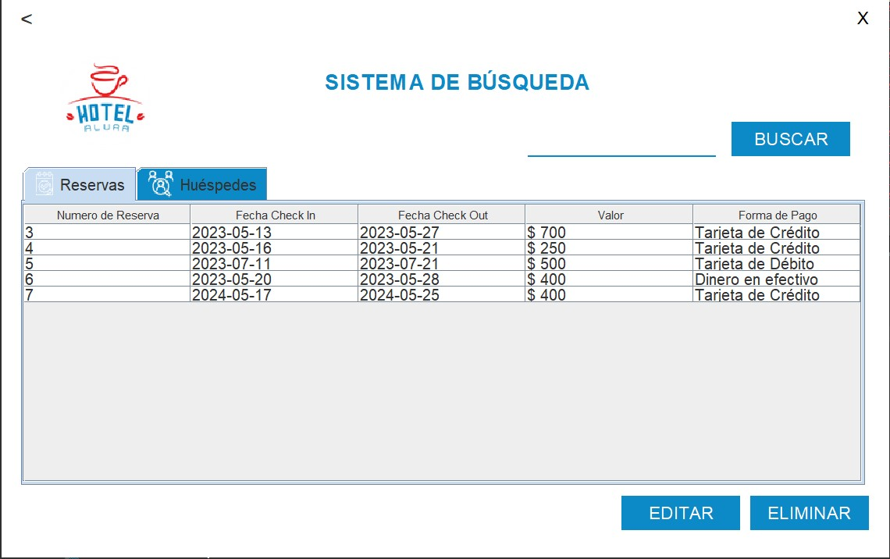 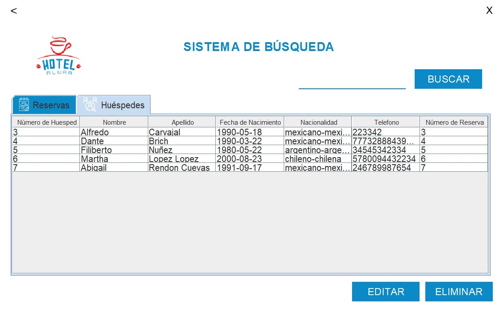

En el campo de búsqueda al introducir el número de ID que desea buscar se desplegará el registro con dicho ID si es que existe.

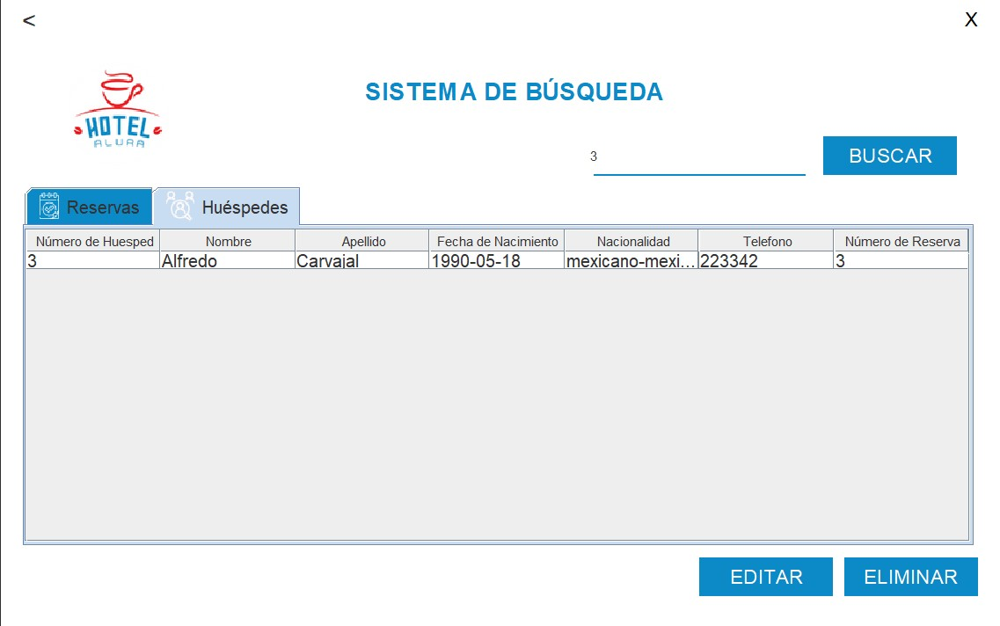

Al modificar algún dato de los campos de los registros de huésped o reserva saldrá una ventana indicando que el registro fue modificado con éxito.

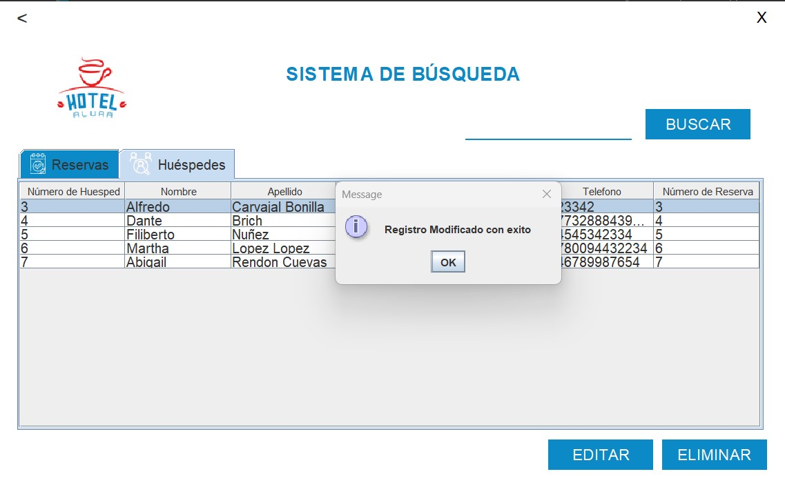 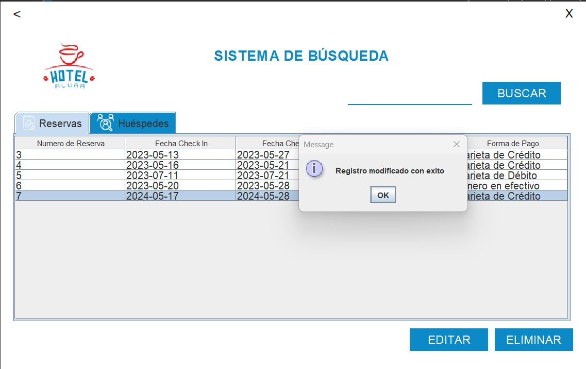

De igual forma al borrar una registro ya sea de huéspedes o reservas, saldrá una ventana de confirmación de si se quiere borrar el registro, posteriormente de borrar el registro, saldrá una ventana que indica que el registro fue borrado con éxito.

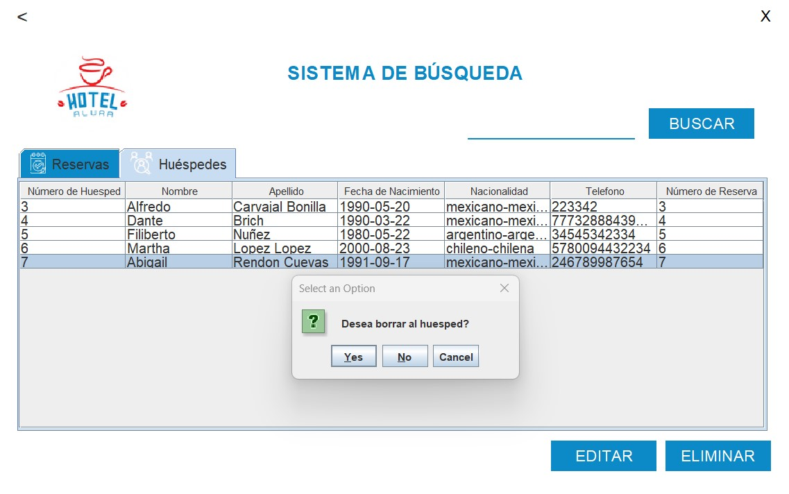  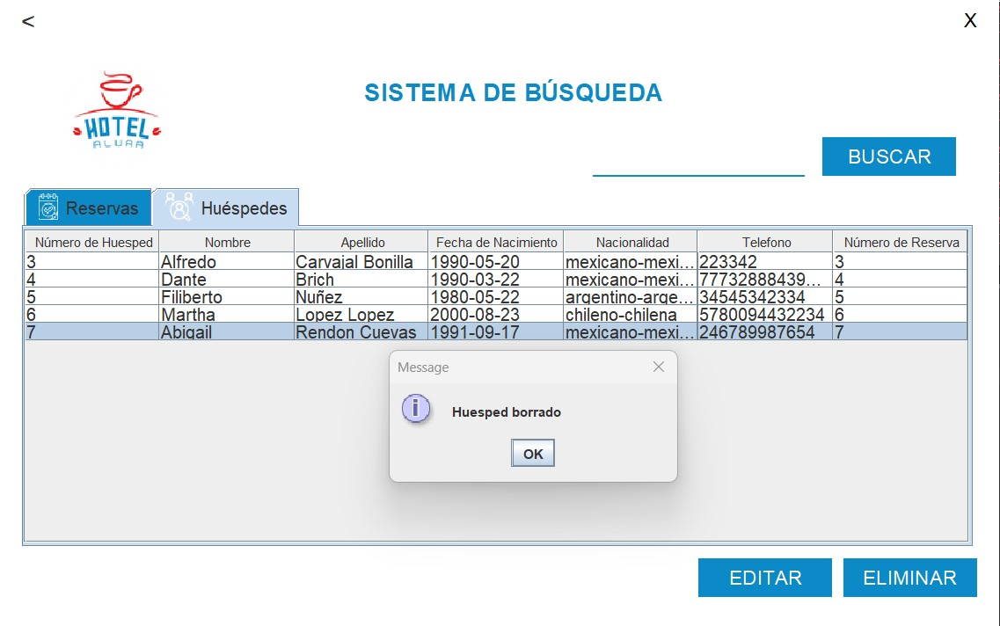

Actualizando la lista de registros sin el elemento borrado.

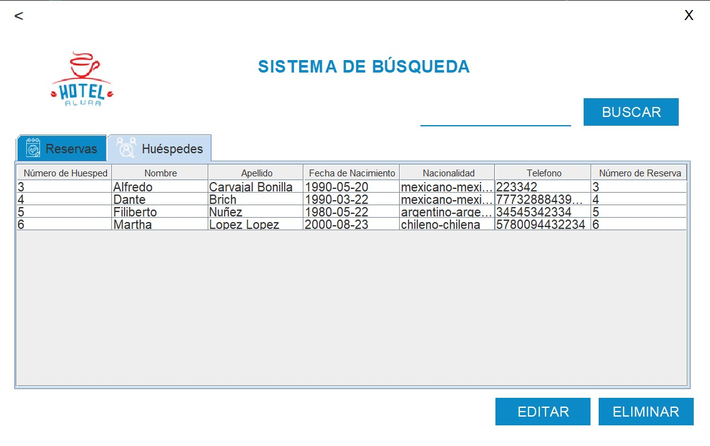
